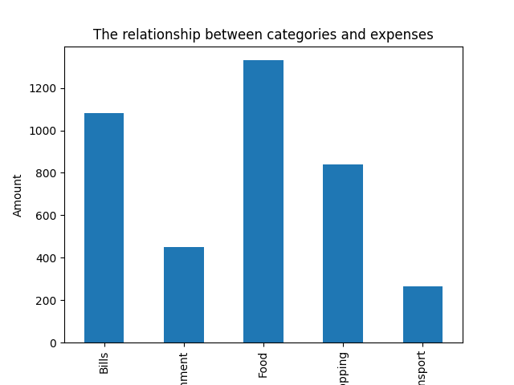
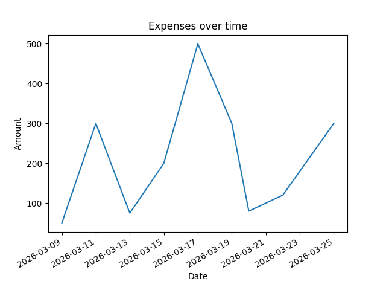

# 💰 Smart Personal Finance Tracker

## 📌 Project Overview

This project analyzes personal expenses to track spending behavior, generate insights, and visualize financial patterns.

---

## 🎯 Objectives

* Monitor daily expenses
* Analyze spending by category
* Identify highest and lowest spending days
* Predict future expenses
* Detect trends in spending behavior

---

## 📂 Dataset

The dataset contains expense records with the following fields:

* `id` → Transaction ID
* `name` → Person name
* `amount` → Expense amount
* `category` → Expense category
* `date` → Transaction date

---

## 🧹 Data Cleaning

* Converted date column to datetime format
* Removed missing values in amount
* Removed duplicate records

---

## 📊 Data Analysis

The project calculates:

* 💰 Total Spending
* 📉 Average Spending
* 📅 Daily Expenses
* 📊 Category-wise Spending
* 📆 Strongest & Weakest Day
* 🔮 Expense Forecasting
* 💸 Budget Comparison
* 📈 Trend Analysis

---

## 📈 Visualizations

### 📊 Expenses by Category



---

### 📈 Expenses Over Time



---

## 🔍 Key Insights

* Food is the highest spending category
* Spending shows a fluctuating but increasing trend
* Certain days have significantly higher expenses
* Forecast indicates potential budget overflow

---

## 🛠️ Technologies Used

* Python
* Pandas
* NumPy
* Matplotlib
* Seaborn

---

## 🚀 Future Improvements

* Add Machine Learning model for better predictions
* Build an interactive dashboard
* Add user input system
* Integrate NLP for expense description classification

---

## ▶️ How to Run

```bash
git clone https://github.com/your-username/your-repo-name.git
cd your-repo-name
pip install pandas numpy matplotlib seaborn
python Smart_personal_finance.py
```

---

## 💼 Author

Developed by [Your Name]

---

## ⭐ Notes

This project demonstrates data analysis, visualization, and basic forecasting techniques using Python.
